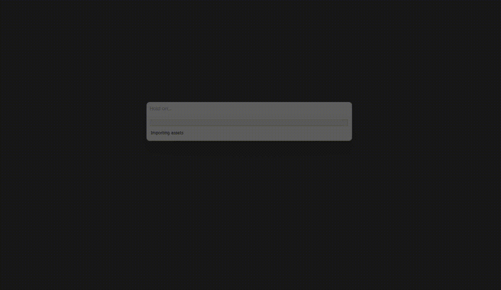

# Pong Game with Custom-Built Neural Network

Este é um repositório que contém um jogo Pong implementado na Unity utilizando uma rede neural construída do zero. O objetivo deste projeto é demonstrar como uma rede neural pode ser implementada e treinada para jogar o clássico jogo Pong.

## Exemplo

## Pré-requisitos
-Unity 20XX.X.X ou superior.
-IDE de desenvolvimento (como Visual Studio ou Visual Studio Code).

## Aprendizagem
- A IA aprende a cada vez que a bola bate em uma das paredes. O cálculo do erro é dado pela distância entre a posição onde a bola tocou na parede e a posição da raquete. Esse valor é multiplicado pela taxa de aprendizagem de 0.01.
- A rede neural ultiliza de 4 camadas.

## Camadas
| Camada   | Função de Ativação       | N° de camadas     |    Descrição                  |
| :---------- | :--------- | :-----------------------: | :----------- |
| `Input` | `Tangente hiperbólica` | 4 | [[posição da bola x, posição da bola y, posição da raquete y, bias = 1]] |
| `hidden1` | `Tangente hiperbólica` | 8 | 8 neurônios na camada oculta   |
| `hidden1` | `Tangente hiperbólica` | 4 | 4 neurônios na camada oculta |
| `output` | `Tangente hiperbólica` | 1 | A função de ativação tangente hiperbólica mostrou-se mais eficaz do que a função bipolarFunctionn |

  

## Contribuição
Contribuições são bem-vindas! Se você tiver sugestões, melhorias ou correções de bugs, fique à vontade para enviar um pull request.

